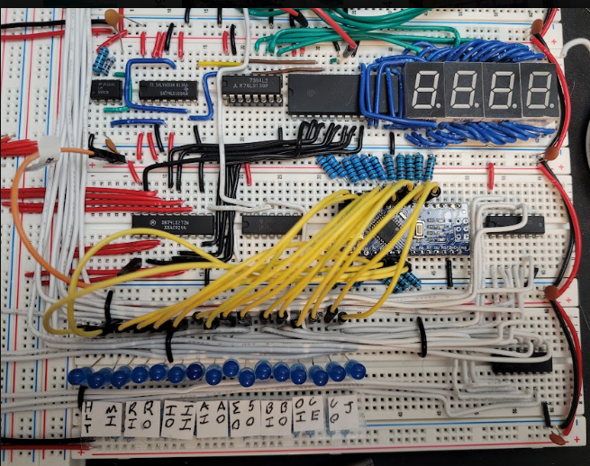
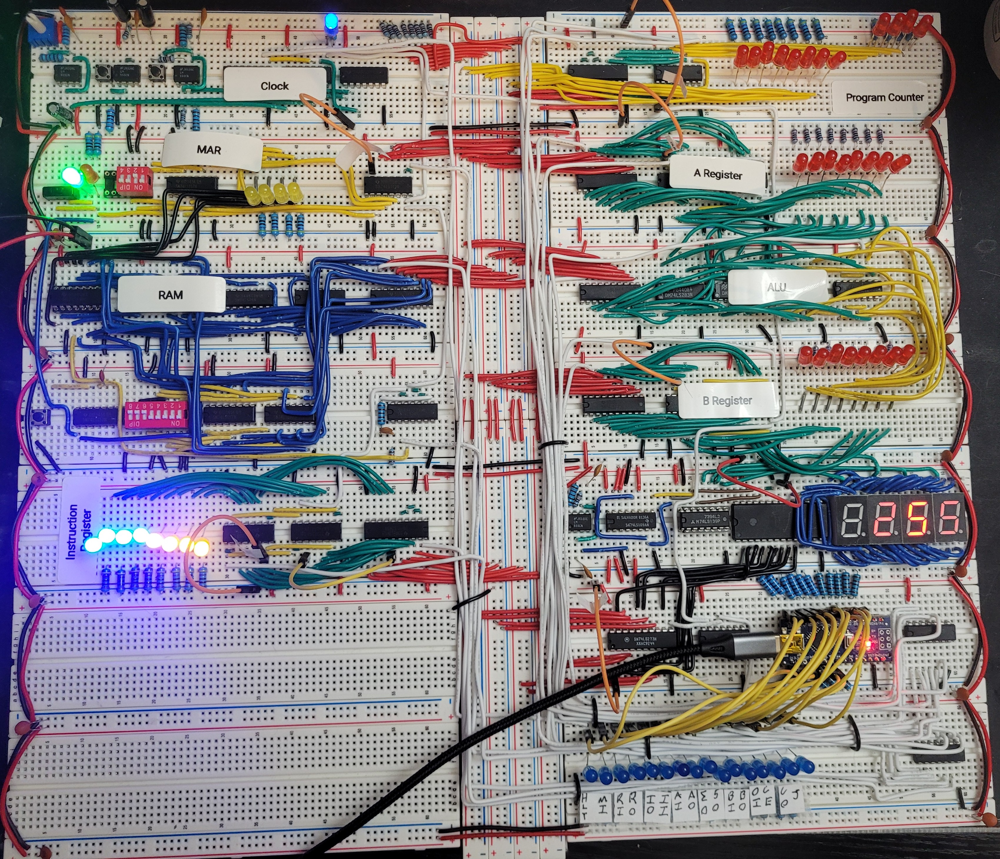

# Arduino Control Augmentation

Just after hooking up all the control lines to their corresponding LED on the first half of the control module, I wanted to make debugging a bit easier than manually changing each jumper cable from low to high. To do this I used an extra arduino nano as a data enable/disable and attached each control line jumper up to it.

Using the serial interface in the Arduino IDE you are able to control the digital I/O pins on the nano by typing the letter or [characters](https://github.com/glynch-NA/SAP-1-Breadboard/blob/main/README.md#control-lines) of the control line you wish to enable/disable. By doing so you can debug efficiently and test each individual operation.

The code is listed [here](arduino_control_code.ino). 

A few important things to keep in mind when applying this, however. 
- The arduino must be plugged in to your controlling device (PC or laptop) <ins>AFTER</ins> the power supply to the 8-bit computer is turned on. Otherwise the data pins of the nano may try to supply the computer with its power thus drawing too much current through the nano and components.
- You must also unplug the arduino first when shutting down the computer for the same reasons as above.
- The ground pin of the arduino needs to be hooked up to the common ground of the computer. But the vcc of the arduino should <ins>NOT</ins> be connected due to enabling a conflicting current supply. 
- Pull down resistors on the control lines is good practice as well for eliminating floating I/O lines.
- The clock must be manually incremented, there is no serial interface interaction to control the clock pulse. 

While this is technically using more than simple logic gate ICs for operating the computer, this is only for debugging and once the other half of the control module is built, this debugging solution is not to be used. It may cause issues with the data pins of the EEPROMs otherwise. 

