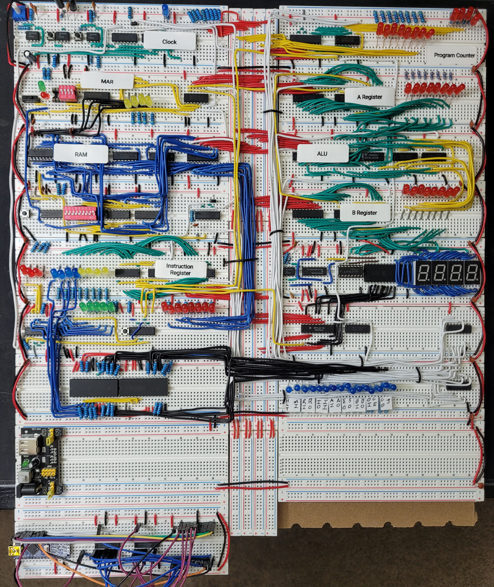

# SAP-1-Breadboard
Based on Ben Eater's video series on YouTube & the schematics available on his website https://eater.net/8bit, this 8-bit SAP(simple as possible) breadboard computer project was a colorful introduction to basic computer architecture. 
